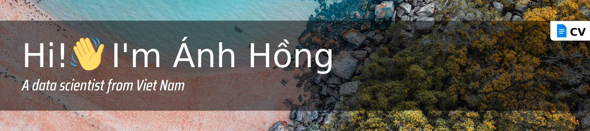

<!-- <h1 align="center">Hi 👋, I'm Trường Nguyễn</h1>
<h3 align="center">A frontend developer from Viet Nam (HoChiMinh)</h3> -->

<h3>🤝 Nice to meet you</h3>

As a Data Scientist; I have necessary skills for creating, managing, maintaining and extending the DS projects. And I regularly do research on more of them.

<h3>💼 Experience</h3>

- 05 / 2022 - 08 / 2023 [AI Learner](https://aivietnam.edu.vn)
  - NLP: Name Entity Recognition, Sentiment Analytic, Text Classification, Text Generation, Image Captioning, Machine Translation, Extractive Question Answering, Chatbot.
- 05 / 2021 - 02 / 2023 [Fado - Data Scientist](https://fado.vn)
  - Built models: classify category; seq2seq; classify ban product by text and image; detect avatar, fingerprint, extract info on id-card for eKYC; recognize captcha.
  - Built server: provided APIs that applied the above models.
  - Also was a sub-leader, managed and supported team developer together.
  - Used python language, multi-process, pytorch, tensorflow, flask, sanic, treamslit.
- 05 / 2019 - 05 / 2021 [Fado - Web Developer](https://fado.vn)
  - Tracked events of users on web (Google Analytics, GTM).
  - Built new APIs, fixed bugs backend.
  - Used php, golang, javascript language, Mariadb for data storage, Rabbitmq for making the workers, Elasticsearch for speeding up the search, Redis and Memcached for caching, Redis for distributed lock.

<h3>📗 Education</h3>

- 05 / 2022 - 08 / 2023 [AI VietNam](https://www.facebook.com/groups/aivietnam.edu.vn)
  - All in one 2022 (Data Science and Artificial Intelligence) of 2 doctors in computer scientist
- 07 / 2022 - 11 / 2022 [Toward Data Science](https://www.facebook.com/TowardDataScience)
  - Machine Learning in Production: build model at ml.azure and build CI/CD at dev.azure
- 06 / 2018 - 01 / 2019 Learn By Myself
  - Computer Science’s path, Data Science’s path, Web Development’s path at https://codecademy.com
  - Algorithms and Data Structure at https://edx.org
- 06 / 2016 - 08 / 2016 Course at The University of Science
  - Introduction to administration and network security (Final exam: 9.0/10)
- 09 / 2009 - 09 / 2013 University of Economics and Law - HCMC
  - Bachelor’s Degree in Accounting - Auditing (GPA: 7.36 /10.00)

<h3>Connect information</h3>

📫 **dinhthianhhong.uel@gmail.com**

📄 [**My CV**](https://docs.google.com/document/d/1xEp9OLR6-Pdo3Hp7sOFTDQDF5Gey7kgKdEajv-vTjtw/edit?usp=sharing)

📞 My phone number **+84 (33) 690-3927**

<h3>Social information</h3>
